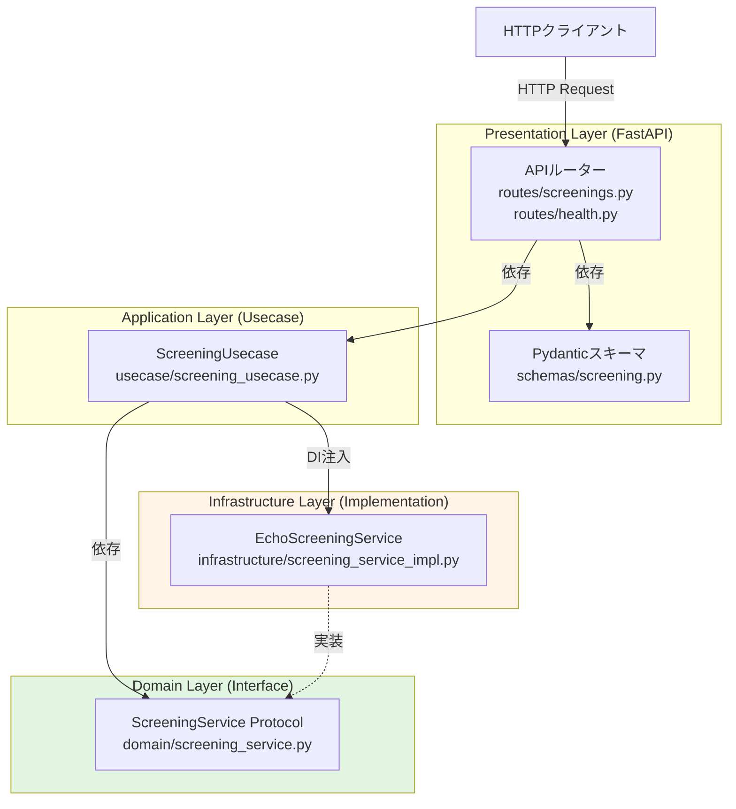

# Design Document

## Overview

「screening-api-core」は、オニオンアーキテクチャに基づく4層構造で構築される採用スクリーニングAPIのコア機能です。本設計では、FastAPIをプレゼンテーション層のフレームワークとして使用し、ドメイン駆動設計（DDD）の原則に従って、ビジネスロジックをフレームワークから独立させます。

初期実装では、スクリーニングロジックは「入力値をそのまま返す」シンプルな実装とし、将来的な機械学習モデルやルールエンジンへの置き換えを容易にするため、依存性逆転の原則を適用したインターフェースベースの設計を採用します。

## Steering Document Alignment

### Technical Standards (tech.md)

本設計は tech.md で定義された技術スタックを採用します：

- **Python 3.12**: 最新の型ヒント機能を活用
- **FastAPI**: 自動OpenAPI生成、Pydanticバリデーション
- **uv**: 依存関係管理とプロジェクト管理
- **pytest**: ユニットテスト、統合テスト
- **ruff**: Linter/Formatter

**アーキテクチャパターン**:
- オニオンアーキテクチャ + DDD
- 依存性逆転の原則（Dependency Inversion Principle）
- インターフェースベースの設計（Protocol）

### Project Structure (structure.md)

本設計は structure.md で定義されたディレクトリ構成に従います：

```text
app/
├── presentation/          # プレゼンテーション層
│   ├── api/
│   │   ├── routes/       # FastAPI ルーター
│   │   └── schemas/      # Pydantic スキーマ
│   └── main.py           # FastAPI アプリケーション
├── usecase/              # アプリケーション層
│   └── screening_usecase.py
├── domain/               # ドメイン層
│   └── screening_service.py  # インターフェース定義
└── infrastructure/       # インフラストラクチャ層
    └── screening_service_impl.py  # 実装
```

**命名規則**:
- モジュール: `snake_case`
- クラス: `PascalCase`
- 関数: `snake_case`
- 定数: `UPPER_SNAKE_CASE`

## Code Reuse Analysis

本仕様は新規プロジェクトのため、既存コードの再利用は該当しません。ただし、以下の標準的なPythonライブラリとパターンを活用します。

### Existing Components to Leverage

- **FastAPI**: RESTful APIフレームワーク、自動OpenAPI生成
- **Pydantic**: データバリデーション、シリアライゼーション
- **typing.Protocol**: インターフェース定義（Duck Typing）

### Integration Points

初期実装では外部システムとの統合はありません。将来的な統合ポイント：

- **認証サービス**: 外部認証プロバイダー（Auth0、Firebase Auth等）
- **機械学習API**: スクリーニングロジックの高度化
- **データベース**: 評価結果の永続化

## Architecture

### 全体アーキテクチャ

オニオンアーキテクチャに基づく4層構造を採用します。依存関係は外側から内側へ向かい、内側の層は外側の層に依存しません。



### 依存関係のルール

1. **Presentation層** → Application層、Domain層
2. **Application層** → Domain層のみ
3. **Infrastructure層** → Domain層（インターフェース実装）
4. **Domain層** → 依存なし（Pure Python）

### Modular Design Principles

- **Single File Responsibility**: 各ファイルは単一の責務を持つ
  - `routes/screenings.py`: スクリーニングエンドポイントのみ
  - `routes/health.py`: ヘルスチェックエンドポイントのみ
  - `screening_usecase.py`: スクリーニングユースケースのみ

- **Component Isolation**: 各層のコンポーネントは独立してテスト可能
  - Domain層のインターフェースはFastAPI非依存
  - Infrastructure層の実装はモック可能

- **Service Layer Separation**: 層ごとに責務を明確に分離
  - Presentation: HTTPリクエスト/レスポンス処理
  - Application: ユースケースのオーケストレーション
  - Domain: ビジネスロジックのインターフェース定義
  - Infrastructure: 外部依存の実装

- **Utility Modularity**: 共通処理は独立した小さなモジュールに分割（将来的に必要に応じて）

## Components and Interfaces

### Component 1: APIルーター（Presentation層）

**ファイル**: `app/presentation/api/routes/screenings.py`

- **Purpose**: スクリーニングエンドポイント `/v1/screenings` の処理
- **Interfaces**:
  ```python
  @router.post("/v1/screenings", response_model=ScreeningResponse)
  async def create_screening(request: ScreeningRequest) -> ScreeningResponse:
      """スクリーニングリクエストを処理"""
  ```
- **Dependencies**:
  - `ScreeningRequest` (Pydantic スキーマ)
  - `ScreeningResponse` (Pydantic スキーマ)
  - `ScreeningUsecase` (Application層)
- **Reuses**: FastAPI の `APIRouter`, `Depends`

**ファイル**: `app/presentation/api/routes/health.py`

- **Purpose**: ヘルスチェックエンドポイント `/health` の処理
- **Interfaces**:
  ```python
  @router.get("/health", response_model=HealthResponse)
  async def health_check() -> HealthResponse:
      """ヘルスチェック"""
  ```
- **Dependencies**:
  - `HealthResponse` (Pydantic スキーマ)
- **Reuses**: FastAPI の `APIRouter`

### Component 2: Pydanticスキーマ（Presentation層）

**ファイル**: `app/presentation/api/schemas/screening.py`

- **Purpose**: リクエスト/レスポンスのデータバリデーションとシリアライゼーション
- **Interfaces**:
  ```python
  class ScreeningRequest(BaseModel):
      content: str

  class ScreeningResponse(BaseModel):
      content: str

  class HealthResponse(BaseModel):
      status: str
  ```
- **Dependencies**: `pydantic.BaseModel`
- **Reuses**: Pydantic のバリデーション機能

### Component 3: ScreeningUsecase（Application層）

**ファイル**: `app/usecase/screening_usecase.py`

- **Purpose**: スクリーニングユースケースのオーケストレーション
- **Interfaces**:
  ```python
  class ScreeningUsecase:
      def __init__(self, screening_service: ScreeningService):
          self._service = screening_service

      def execute(self, content: str) -> str:
          """スクリーニングを実行し、結果を返す"""
  ```
- **Dependencies**:
  - `ScreeningService` (Domain層のインターフェース)
- **Reuses**: なし（Pure Python）

### Component 4: ScreeningService Protocol（Domain層）

**ファイル**: `app/domain/screening_service.py`

- **Purpose**: スクリーニングサービスのインターフェース定義
- **Interfaces**:
  ```python
  from typing import Protocol

  class ScreeningService(Protocol):
      def screen(self, content: str) -> str:
          """スクリーニングを実行し、結果を返す"""
          ...
  ```
- **Dependencies**: `typing.Protocol` のみ
- **Reuses**: Pythonの `Protocol` による構造的部分型（Structural Subtyping）

### Component 5: EchoScreeningService（Infrastructure層）

**ファイル**: `app/infrastructure/screening_service_impl.py`

- **Purpose**: スクリーニングサービスの具体的実装（入力値をそのまま返す）
- **Interfaces**:
  ```python
  class EchoScreeningService:
      def screen(self, content: str) -> str:
          """入力値をそのまま返す暫定実装"""
          return content
  ```
- **Dependencies**: なし（Pure Python）
- **Reuses**: なし

### Component 6: FastAPIアプリケーション（Presentation層）

**ファイル**: `app/presentation/main.py`

- **Purpose**: FastAPIアプリケーションのエントリーポイント、ルーター登録、依存性注入の設定
- **Interfaces**:
  ```python
  app = FastAPI(title="Screening API", version="1.0.0")
  app.include_router(screenings_router)
  app.include_router(health_router)
  ```
- **Dependencies**:
  - `screenings_router` (routes/screenings.py)
  - `health_router` (routes/health.py)
- **Reuses**: FastAPI の `FastAPI`, `APIRouter`

## Data Models

### ScreeningRequest（リクエストモデル）

```python
from pydantic import BaseModel, Field

class ScreeningRequest(BaseModel):
    """スクリーニングリクエスト"""
    content: str = Field(..., description="スクリーニング対象のテキスト")

    model_config = {
        "json_schema_extra": {
            "examples": [
                {"content": "応募者情報のテキスト"}
            ]
        }
    }
```

### ScreeningResponse（レスポンスモデル）

```python
from pydantic import BaseModel, Field

class ScreeningResponse(BaseModel):
    """スクリーニングレスポンス"""
    content: str = Field(..., description="処理結果（入力値のエコー）")

    model_config = {
        "json_schema_extra": {
            "examples": [
                {"content": "応募者情報のテキスト"}
            ]
        }
    }
```

### HealthResponse（ヘルスチェックレスポンス）

```python
from pydantic import BaseModel, Field

class HealthResponse(BaseModel):
    """ヘルスチェックレスポンス"""
    status: str = Field(default="ok", description="ヘルスステータス")
```

## Error Handling

### Error Scenarios

#### 1. バリデーションエラー（422 Unprocessable Entity）

- **Scenario**: リクエストボディが不正なJSON形式、または `content` フィールドが存在しない
- **Handling**:
  - FastAPI + Pydantic の自動バリデーション機能により検出
  - HTTPステータス 422 を返す
  - エラー詳細を含むJSONレスポンスを返す
- **User Impact**:
  ```json
  {
    "detail": [
      {
        "type": "missing",
        "loc": ["body", "content"],
        "msg": "Field required",
        "input": {}
      }
    ]
  }
  ```

#### 2. Content-Type エラー（415 Unsupported Media Type）

- **Scenario**: リクエストの Content-Type が `application/json` でない
- **Handling**:
  - FastAPI が自動的に検出し、HTTPステータス 415 を返す
- **User Impact**:
  ```json
  {
    "detail": "Content-Type must be application/json"
  }
  ```

#### 3. サーバーエラー（500 Internal Server Error）

- **Scenario**: 予期しない内部エラーが発生
- **Handling**:
  - FastAPI のグローバルエラーハンドラーで捕捉
  - エラーログを出力
  - HTTPステータス 500 を返す
  - 内部エラー詳細は隠蔽し、汎用的なエラーメッセージを返す
- **User Impact**:
  ```json
  {
    "detail": "Internal server error"
  }
  ```

### エラーハンドリング戦略

- **Pydanticバリデーション**: 入力データの自動検証
- **FastAPI例外ハンドラー**: グローバルエラーハンドリング
- **ログ出力**: エラー発生時の詳細ログ（開発環境では詳細、本番環境では最小限）
- **セキュリティ**: 内部実装の詳細を外部に漏らさない

## Testing Strategy

### Unit Testing

各層を独立してテストします。

#### Domain層のテスト

**ファイル**: `tests/unit/domain/test_screening_service.py`

- **テスト対象**: `ScreeningService` Protocol（型定義の確認）
- **テストケース**:
  - Protocol に準拠した実装が正しく動作することを確認

#### Application層のテスト

**ファイル**: `tests/unit/usecase/test_screening_usecase.py`

- **テスト対象**: `ScreeningUsecase`
- **テストケース**:
  - `execute()` メソッドが `ScreeningService.screen()` を正しく呼び出すことを確認
  - モック（`MagicMock`）を使用して `ScreeningService` をモック化
  - 入力値が正しく渡され、戻り値が正しく返されることを確認

#### Infrastructure層のテスト

**ファイル**: `tests/unit/infrastructure/test_screening_service_impl.py`

- **テスト対象**: `EchoScreeningService`
- **テストケース**:
  - `screen()` メソッドが入力値をそのまま返すことを確認
  - 空文字列、長文テキストなど、境界値のテスト

#### Presentation層のテスト

**ファイル**: `tests/unit/presentation/test_schemas.py`

- **テスト対象**: Pydantic スキーマ（`ScreeningRequest`, `ScreeningResponse`, `HealthResponse`）
- **テストケース**:
  - 正しいデータでバリデーションが成功することを確認
  - 不正なデータでバリデーションが失敗することを確認

### Integration Testing

各層を統合してテストします。

**ファイル**: `tests/integration/test_screening_integration.py`

- **テスト対象**: Presentation層 → Application層 → Infrastructure層の統合
- **テストケース**:
  - FastAPI `TestClient` を使用して実際のHTTPリクエストをシミュレート
  - `/v1/screenings` エンドポイントに正常なリクエストを送信し、正しいレスポンスが返ることを確認
  - 不正なリクエストに対して適切なエラーレスポンスが返ることを確認

**ファイル**: `tests/integration/test_health_integration.py`

- **テスト対象**: `/health` エンドポイント
- **テストケース**:
  - `/health` エンドポイントにリクエストを送信し、`{"status": "ok"}` が返ることを確認

### End-to-End Testing

**ファイル**: `tests/e2e/test_api_e2e.py`

- **テスト対象**: API全体の動作
- **テストケース**:
  - 実際のアプリケーションを起動し、HTTPクライアント（`httpx`）でリクエストを送信
  - `/v1/screenings` と `/health` の両エンドポイントが正常に動作することを確認

### テストカバレッジ目標

- **ユニットテスト**: 各層で 80% 以上のコードカバレッジ
- **統合テスト**: エンドポイントごとの主要パスを網羅
- **E2Eテスト**: 主要なユーザーシナリオを網羅

## Deployment Considerations

### 開発環境

- **起動コマンド**: `uv run fastapi dev app/presentation/main.py`
- **ホットリロード**: FastAPI の開発モードで自動リロード
- **ポート**: デフォルト 8000

### OpenAPI仕様書の生成

- **自動生成**: FastAPI が `/openapi.json` エンドポイントで自動生成
- **YAML出力**: 以下のスクリプトで `openapi.yaml` を生成
  ```python
  import json
  import yaml
  from app.presentation.main import app

  openapi_json = app.openapi()
  with open("openapi.yaml", "w") as f:
      yaml.dump(openapi_json, f, sort_keys=False)
  ```

### 依存性注入

FastAPI の `Depends` を使用して、Infrastructure層の実装をPresentation層に注入します。

**ファイル**: `app/presentation/api/dependencies.py`

```python
from app.domain.screening_service import ScreeningService
from app.infrastructure.screening_service_impl import EchoScreeningService
from app.usecase.screening_usecase import ScreeningUsecase

def get_screening_service() -> ScreeningService:
    """ScreeningService の実装を返す"""
    return EchoScreeningService()

def get_screening_usecase(
    service: ScreeningService = Depends(get_screening_service)
) -> ScreeningUsecase:
    """ScreeningUsecase のインスタンスを返す"""
    return ScreeningUsecase(service)
```

**ルーターでの使用**:

```python
@router.post("/v1/screenings", response_model=ScreeningResponse)
async def create_screening(
    request: ScreeningRequest,
    usecase: ScreeningUsecase = Depends(get_screening_usecase)
) -> ScreeningResponse:
    result = usecase.execute(request.content)
    return ScreeningResponse(content=result)
```

## Future Extensibility

本設計は将来的な拡張を容易にします：

### 高度なスクリーニングロジックへの置き換え

Infrastructure層の実装を変更するだけで、Domain層とApplication層は変更不要：

```python
# 新しい実装例
class MLScreeningService:
    """機械学習ベースのスクリーニング実装"""
    def screen(self, content: str) -> str:
        # 機械学習モデルを呼び出す
        result = ml_model.predict(content)
        return result
```

依存性注入の設定を変更：

```python
def get_screening_service() -> ScreeningService:
    return MLScreeningService()  # 実装を変更
```

### 永続化層の追加

Infrastructure層にリポジトリパターンを追加：

```python
# domain/screening_repository.py
class ScreeningRepository(Protocol):
    def save(self, screening: Screening) -> None: ...

# infrastructure/screening_repository_impl.py
class PostgresScreeningRepository:
    def save(self, screening: Screening) -> None:
        # データベースに保存
```

### 認証・認可の追加

Presentation層に認証ミドルウェアを追加：

```python
from fastapi import Depends, HTTPException
from fastapi.security import HTTPBearer

security = HTTPBearer()

@router.post("/v1/screenings")
async def create_screening(
    request: ScreeningRequest,
    token: str = Depends(security)
):
    # トークン検証ロジック
```
